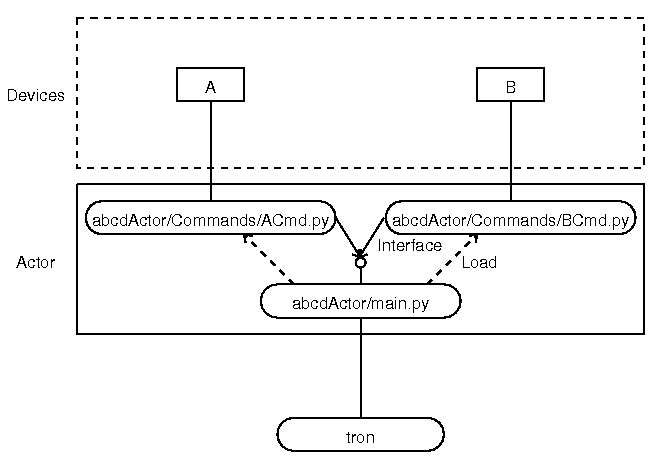

Get started to develop new actor for tron
=========================================

Preparation
-----------

Setup tron and actorecore to be able to run. (Refer document included in "tron".)
Also refer documentation on how tron works.

Make sekelton from template
---------------------------

"actorcore" repository has directory named "templateActor" and setup script "bin/genActor".
Decide name for your new actor (here use "abcd"), and run following command.::

  bin/genActor abcd

This will modify templates in "templateActor" and generate skelton into "abcdActor" direcotry. Initial 
configurations of this skelton will be : actor name and class name of "abcd".

Run skelton first time
----------------------

Note: this paragraph will be changed by further development.
"config/hub.py" configuration file in "tron" code has configuration for a connection from the tron to 
an actor like::

 actors = dict(iic=       dict(host="localhost", port=9000, actorName='mhsActor'),

You need to add your new actor into this python dictionary, with host and port name.

Run the tron itself with::

 tron start

Also you can monitor connections with lunching hubclient.

Every actor will be managed by eups, you need to register your code into eups at the actor directory with::

  cd abcdActor/
  setup -v -r .

After registeration, you can run your new skelton with::

 stageManger abcdActor start

This skelton only implements required (at least!) commands: "ping" and "status". 
To check, you can send "ping" command from hubclient with typing "abcd ping". 

Code organization
-----------------

You got following files and directories as an actor skelton.

 - etc/abcd.cfg
 - INSTALL.txt
 - python/abcdActor/Commands/TopCmd.py
 - python/abcdActor/Commands/__init__.py
 - python/abcdActor/main.py
 - python/abcdActor/__init__.py
 - setup.py
 - ups/abcdActor.table

etc/abcd.cfg - at least required configuration for running actor
----------------------------------------------------------------

This file is currently existing in etc of actor as .ini format, but possibly 
will be modified into python script or moved into another repository only used 
for configurations. This file includes (tron) protocol level definitions, such 
as the target tron server and an actor itself. 

The skelton file includes comments which help you to configure.

setup.py, ups/abcdActor.table - used for eups
---------------------------------------------

"setup.py" is a setup script to eups, ups/abcdActor.table specifies dependency 
to other codes used by eups package manager.

python/abcdActor/main.py - kick starter of an actor
---------------------------------------------------

This file defines OurActor (name will not be used for reference purpose, but 
just used in this script) overrides actorcore.Actor.Actor class. 
An actor name is defined in this script as following part::

 def main():
     theActor = OurActor('abcd', productName='abcdActor')
     theActor.run()

Things will be changed in future development, but currently you need to change 
this actor name (first option for OurActor constructor) if you have multiple 
actor instance for the same code, e.g. SpS.

python/abcdActor/Commands/TopCmd.py - sample definition of command
------------------------------------------------------------------

This script defines two commands - "ping" and "status" within TopCmd class. 
Files placed in Commands directory as \*Cmd.py will be automatically loaded by 
the actorcore class as command definitions.

Adding commands and keywords
----------------------------

Every python script named as \*Cmd.py in "Commands" directory will be loaded 
by the actorcore class as command definitions, but you need to register your 
added commands (class methods) in their constructor. This section describes 
how you can register them, and what you need to do at least. 
Also for writting an actor, you will need to use some classes defined in 
opscore namespace (in actorcore repository). 

Each class (defined in \*Cmd.py, such as TopCmd class defined at TopCmd.py in 
a skelton) shall define class as sub class of "object" (TBC; any allowed other 
super classes?), and its constructor will be called with an instance of 
actorcore.Actor class to be used in the class as a connecting point to a main 
thread of an actor (waked up by .run() in main.py).

Registering new commands
------------------------

To register new commands in each class, you need to register handler method 
to self.vocab list as tuple of command name, options, reference to the method. 
When a command was posted from the tron, an actor will call the specified 
method with actorcore.Command object as its option, e.g. ping(self, cmd). Each 
method is required to take action with interfacing to the actorcore.Command 
object (instatnce). 

Format of registration tuple is organized as ("command name", "options", 
"reference to the method"), like::

  self.vocab = [
    ('ping', '', self.ping),
    ('status', '', self.status),
    ('expose', '@(bias|test)', self.expose),
    ('expose', '@(dark|object) <expTime>', self.expose),
    ('centroid', '<expTime>', self.centroid),
    ('reconnect', '', self.reconnect),
  ]

"options" defined in second item is white-space separated list of options in 
formats of::

  "@()" as "|" separated list of possible option string, 
  "<xxx>" as command argument name used as "xxx=yyy".

Each command argument name shall be separatedly registered into self.keys as 
opscore.protocols.keys.KeysDictionary object, like::

  # Define typed command arguments for the above commands.
  self.keys = keys.KeysDictionary("mcs_mcs", (1, 1),
        keys.Key("expTime", types.Float(), help="The exposure time"),
    )

where, first argument as "<actor name>_<class name>" (sample as McsCmd class in 
mcs actor), third to final arguments as opscore.protocols.keys.Key object. This 
object will take arguments for its constructor as: 
first argument is identical with name specified in taples for self.vocab, 
second argument is object from types, 
third to final arguments as options like "help". 
The actorcore instance will check each command with specified object types 
(using handler classes in opscore namespace), and just return error before 
passing to registerd methods if any type violation found. 

After each method called, each method is required to interface to the caller 
by passed argument "cmd" (instance of actorcore.Command.Command class) using: 

 - command option in a message through the tron: cmd.cmd.keywords
 - defined methods in Command class to reply (refer following section)

Registering new keywords
------------------------

..todo.. TO BE WRITTEN.

Command class (actorcore.Command.Command class) quick reference
---------------------------------------------------------------

You can return message to a caller with following methods in Command class. 
Each method will take one argument as a reponse passed to a caller. You can 
read each message using hubclient, and first charactor will be displaied in 
each message. 

 - respond : 'i', information
 - inform : 'i', information
 - diag : 'd', diagnostic
 - warn : 'w', warning
 - error : 'e', error
 - fail : 'f', failed

And you need to call 'finish' method to finish the handler. This message 
will be displaied as ':'.

Next step?
----------

 - How \*Cmd.py modules are managed by Actor class : instance and loading
 - Reference of opscore resource handler classes
 - Work with twisted
 - More complex samples

