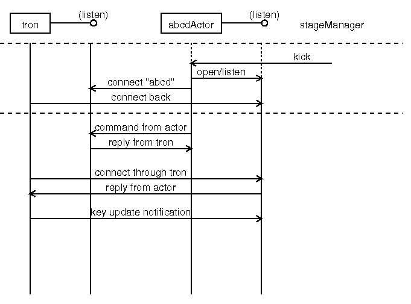

Tron and actor : how it works
=============================

Connection between tron and actor
---------------------------------

We need two connections between the tron server and an actor: A) one is actor 
command flow connecting from an actor to the tron server, and B) the other is 
tron command and key flow connecting from the tron server to an actor. Setting 
for two connections are in an actor side (which address and port the tron 
server is listening) and the tron server side (python dictionaly of an acotr 
name to target connecting point: address and port), respectively. A connection 
will be initialized by an actor, right after "stageManager actor start" issued, 
with a name of an actor. When the tron server receives a connection from new 
actor, the tron server searches its dictionaly (currently written in a config 
file within tron code, actors dictionaly defined in config/hub.py; Note this 
could be changed in future release), and will try to connect an actor with 
retrieved address and port. If some connection already issued to the same set, 
an existing connection will be closed and a new connection will be issued. 

A connecting actor will get a connection from the tron server right after 
connecting to the tron server. If a connecting actor will not receive any 
connection request from the tron server, something wrong is happening like 
misconfigurations in an actor, e.g. using a wrong actor name.

Commands from an actor will be sent through A) and proxied by the tron server 
to other actors (depends on configurations within the tron server). Also these 
issued commands from other actors or updated keys by other actors will be 
pushed from the tron server through B), and an actor needs to do something and 
response via provided message categories (e.g. inform, warn) if required. 

Messages over tron - command and key
------------------------------------

There are two messages over the tron server: command and key. "command" is one 
line simple strings in a format of "<command> <option>=<value>" posted from 
an actor side. "key" is keyword and value pair, which will be cached in the 
tron server at any time, and will be updated by an actor on demand. 

Next step?
----------

Now you understand how tron system works, basically. Let's get into development 

 - "Get started to develop new actor for tron"

